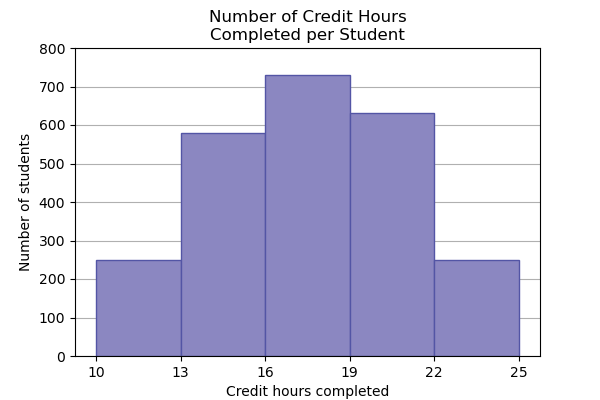

# Exercises

## 1.1. Determine what the key terms refer to in the following study.

> We want to know the average (mean) amount of money spent on school uniforms each year by families with children at Knoll Academy. We randomly survey 100 families with children in the school. Three of the families spent $65, $75, and $95, respectively.

- The **population** is the entirety of the families with children at Knoll Academy.
- The **sample** is the collection of the randomly selected 100 families with children in the school.
- The **parameter** is the average amount of money spent by this population on school uniforms each year.
- The **statistic** is the average amount of money spent by this sample on school uniforms each year.
- The **variable** is the amount of money spent on schools uniforms each year.
- The **data** are the monetary values collected for this variable.

## 1.2. What type of data is this?

> The data are the number of machines in a gym. You sample five gyms. One gym has 12 machines, one gym has 15 machines, one gym has ten machines, one gym has 22 machines, and the other gym has 20 machines.

This is a quantitative discrete data, since the data are numbers produced by counting.

## 1.3. What type of data is this?

> The data are the areas of lawns in square feet. You sample five houses. The areas of the lawns are 144 sq. feet, 160 sq. feet, 190 sq. feet, 180 sq. feet, and 210 sq. feet.

This is a quantitative continuous data, since the data are numbers produced by measuring. Although, these values look discrete, area is a continuous variable (unless we limit ourself to areas rounded off to the nearest integer).

## 1.4. What type of data is this?

> The data are the colors of houses. You sample five houses. The colors of the houses are white, yellow, white, red, and white.

This is a qualitative data, since the data is categorical in nature.

## 1.5. Determine the correct data type (quantitative or qualitative) for the number of cars in a parking lot. Indicate whether quantitative data are continuous or discrete.

The number of cars in a parking lot is a quantitative discrete data, since the data are numbers produced by counting.

## 1.6. What type of data does this graph show?

> The registrar at State University keeps records of the number of credit hours students complete each semester. The data he collects are summarized in the histogram. The class boundaries are 10 to less than 13, 13 to less than 16, 16 to less than 19, 19 to less than 22, and 22 to less than 25.

The number of credit hours students complete each semester is a quantitative discrete data, since the data are numbers produced by counting.
