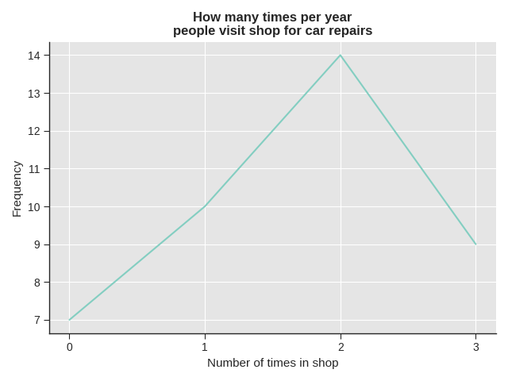
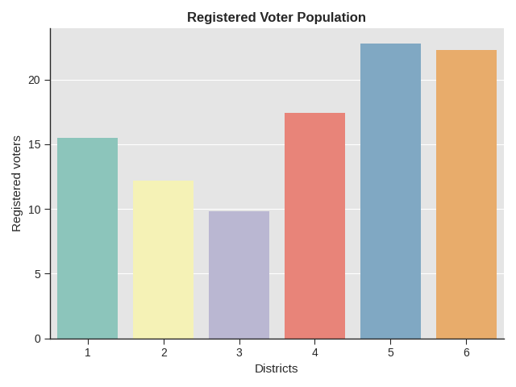
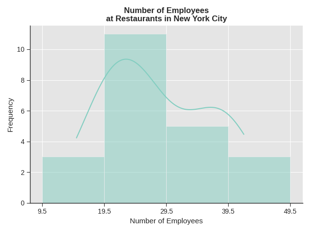
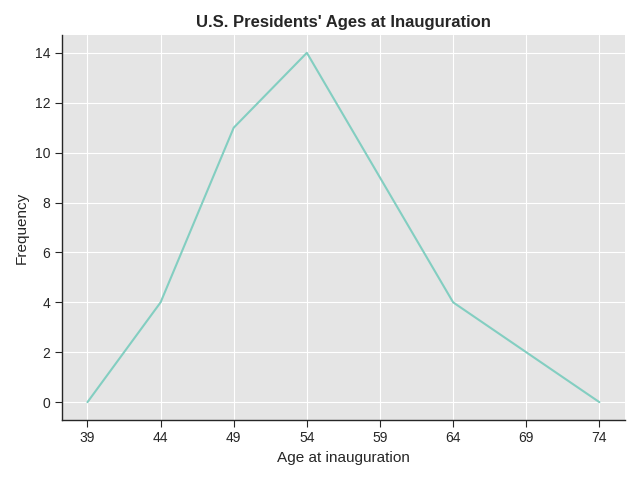
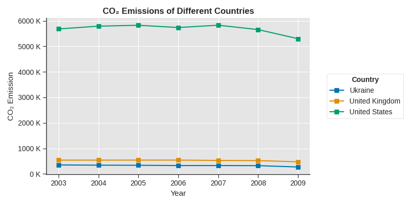

# Exercises

## 2.1. Construct a stem plot for the data.

> For the Park City basketball team, scores for the last 30 games were as follows (smallest to largest):

$$
32, 32, 33, 34, 38, 40, 42, 42, 43, 44, 46, 47, 47, 48, 48, 48, 49, 50, 50, 51, 52, 52, 52, 53, 54, 56, 57, 57, 60, 61
$$

| Stem | Leaf                    |
| ---- | ----------------------- |
| 3    | 2 2 3 4 8               |
| 4    | 0 2 2 3 4 6 7 7 8 8 8 9 |
| 5    | 0 0 1 2 2 2 3 4 6 7 7   |
| 6    | 0 1                     |

## 2.2. Create a stem plot using the data and identify any outliers.

> The following data show the distances (in miles) from the homes of off-campus statistics students to the college.

$$
0.5, 0.7,
1.1, 1.2, 1.2, 1.3, 1.3, 1.5, 1.5, 1.7, 1.7, 1.8, 1.9,
2.0, 2.2, 2.5, 2.6, 2.8, 2.8, 2.8,
3.5, 3.8,
4.4, 4.8, 4.9,
5.2, 5.5, 5.7, 5.8,
8.0
$$

| Stem | Leaf                  |
| ---- | --------------------- |
| 0    | 5 7                   |
| 1    | 1 2 2 3 3 5 5 7 7 8 9 |
| 2    | 0 2 5 6 8 8 8         |
| 3    | 5 8                   |
| 4    | 4 8 9                 |
| 5    | 2 5 7 8               |
| 6    |                       |
| 7    |                       |
| 8    | 0                     |

The value $8.0$ appear to be an outlier. Values appear to concentrate at one and two miles.

## 2.3. Create a side-by-side stem-and-leaf plot of these wins and losses.

> The table shows the number of wins and losses the Atlanta Hawks have had in 42 seasons.

| Losses | Wins | Year      | Losses | Wins | Year      |
| ------ | ---- | --------- | ------ | ---- | --------- |
| 34     | 48   | 1968–1969 | 41     | 41   | 1989–1990 |
| 34     | 48   | 1969–1970 | 39     | 43   | 1990–1991 |
| 46     | 36   | 1970–1971 | 44     | 38   | 1991–1992 |
| 46     | 36   | 1971–1972 | 39     | 43   | 1992–1993 |
| 36     | 46   | 1972–1973 | 25     | 57   | 1993–1994 |
| 47     | 35   | 1973–1974 | 40     | 42   | 1994–1995 |
| 51     | 31   | 1974–1975 | 36     | 46   | 1995–1996 |
| 53     | 29   | 1975–1976 | 26     | 56   | 1996–1997 |
| 51     | 31   | 1976–1977 | 32     | 50   | 1997–1998 |
| 41     | 41   | 1977–1978 | 19     | 31   | 1998–1999 |
| 36     | 46   | 1978–1979 | 54     | 28   | 1999–2000 |
| 32     | 50   | 1979–1980 | 57     | 25   | 2000–2001 |
| 51     | 31   | 1980–1981 | 49     | 33   | 2001–2002 |
| 40     | 42   | 1981–1982 | 47     | 35   | 2002–2003 |
| 39     | 43   | 1982–1983 | 54     | 28   | 2003–2004 |
| 42     | 40   | 1983–1984 | 69     | 13   | 2004–2005 |
| 48     | 34   | 1984–1985 | 56     | 26   | 2005–2006 |
| 32     | 50   | 1985–1986 | 52     | 30   | 2006–2007 |
| 25     | 57   | 1986–1987 | 45     | 37   | 2007–2008 |
| 32     | 50   | 1987–1988 | 35     | 47   | 2008–2009 |
| 30     | 52   | 1988–1989 | 29     | 53   | 2009–2010 |

The side-by-side stem-and-leaf plot is shown below:

| Losses                      |     | Wins                        |
| --------------------------- | --- | --------------------------- |
| 9                           | 1   | 3                           |
| 9 6 5 5                     | 2   | 5 6 8 8 9                   |
| 9 9 9 6 6 6 5 4 4 2 2 2 2 0 | 3   | 0 1 1 1 1 3 4 5 5 6 6 7 8   |
| 9 8 7 7 6 6 5 4 2 1 1 0 0   | 4   | 0 1 1 2 2 3 3 3 6 6 6 7 8 8 |
| 7 6 4 4 3 2 1 1 1           | 5   | 0 0 0 0 2 3 6 7 7           |
| 9                           | 6   |                             |

## 2.4. Construct a line graph.

> In a survey, 40 people were asked how many times per year they had their car in the shop for repairs. The results are shown in the following table.

| Number of times in shop | Frequency |
| ----------------------- | --------- |
| 0                       | 7         |
| 1                       | 10        |
| 2                       | 14        |
| 3                       | 9         |

The line graph for this data is shown below:

## 2.5. Construct a bar graph showing the proportions.

> The population in Park City is made up of children, working-age adults, and retirees. The table below shows the three age groups, the number of people in the town from each age group, and the proportion (%) of people in each age group.

| Age groups         | Number of people | Proportion of population |
| ------------------ | ---------------- | ------------------------ |
| Children           | 67,059           | 19%                      |
| Working-age adults | 152,198          | 43%                      |
| Retirees           | 131,662          | 38%                      |

The bar graph for this data is shown below:

## 2.6. Construct a bar graph that shows the registered voter population by district.

> Park City is broken down into six voting districts. This table shows the percent of the total registered voter population that lives in each district as well as the percent total of the entire population that lives in each district.

| District | Registered voter population | Overall city population |
| -------- | --------------------------- | ----------------------- |
| 1        | 15.5%                       | 19.4%                   |
| 2        | 12.2%                       | 15.6%                   |
| 3        | 9.8%                        | 9.0%                    |
| 4        | 17.4%                       | 18.5%                   |
| 5        | 22.8%                       | 20.7%                   |
| 6        | 22.3%                       | 16.8%                   |

The bar graph for this data is shown below:

## 2.7. Construct a histogram and calculate the width of each bar or class interval.

> The following data are the shoe sizes of 50 male students. The sizes are continuous data since shoe sizes is measured. Suppose you choose six bars.

$$
9, 9, 9.5, 9.5, 10, 10, 10, 10, 10, 10, 10.5, 10.5, 10.5, 10.5, 10.5, 10.5, 10.5, 10.5, \\
11, 11, 11, 11, 11, 11, 11, 11, 11, 11, 11, 11, 11, 11.5, 11.5, 11.5, 11.5, 11.5, 11.5, 11.5, \\
12, 12, 12, 12, 12, 12, 12, 12.5, 12.5, 12.5, 12.5, 14
$$

The width of each bar is chosen to be $1$ by rounding to the nearest whole number.

The histogram for this data is shown below:

## 2.8. Fill in the blanks for the following sentences.

> The following data are the number of sports played by 50 student athletes. The number of sports is discrete data since sports are counted. 20 student athletes play one sport, 22 student athletes play two sports, and eight student athletes play three sports.

$$
1, 1, 1, 1, 1, 1, 1, 1, 1, 1, 1, 1, 1, 1, 1, 1, 1, 1, 1, 1 \\
2, 2, 2, 2, 2, 2, 2, 2, 2, 2, 2, 2, 2, 2, 2, 2, 2, 2, 2, 2, 2, 2 \\
3, 3, 3, 3, 3, 3, 3, 3
$$

Since the data consist of the numbers 1, 2, and 3, and the starting point is 0.5, a width of one places the 1 in the middle of the interval 0.5 to **(BLANK)**, the 2 in the middle of the interval from **(BLANK)** to **(BLANK)**, and the 3 in the middle of the interval from **(BLANK)** to **(BLANK)**.

- $1.5$
- $1.5$ to $2.5$
- $2.5$ to $3.5$

## 2.9. Using this data, create a histogram.

The following data represents the number of employees at various restaurants in New York City. Use $10$ to $19$ as the first interval.

$$
22, 35, 15, 26, 40, 28, 18, 20, 25, 34, 39, 42, 24, 22, 19, 27, 22, 34, 40, 20, 38, 28
$$

The histogram for this data is shown below:

## 2.10. Construct a frequency polygon of U.S. presidents' ages at inauguration shown in the following table.

| Age of inauguration | Frequency |
| ------------------- | --------- |
| 41.5 to 46.5        | 4         |
| 46.5 to 51.5        | 11        |
| 51.5 to 56.5        | 14        |
| 56.5 to 61.5        | 9         |
| 61.5 to 66.5        | 4         |
| 66.5 to 71.5        | 2         |

The frequency polygon of this data is shown below:

## 2.11. Use the table to construct a time series graph for C0₂ emissions for these countries.

> The following table is a portion of a dataset from [World Bank](www.worldbank.org).

| Year | Ukraine | United Kingdom | United States |
| ---- | ------- | -------------- | ------------- |
| 2003 | 352259  | 540640         | 5681664       |
| 2004 | 343121  | 540409         | 5790761       |
| 2005 | 339029  | 541990         | 5826394       |
| 2006 | 327797  | 542045         | 5737615       |
| 2007 | 328357  | 528631         | 5828697       |
| 2008 | 323657  | 522247         | 5656839       |
| 2009 | 272176  | 474579         | 5299563       |

The time series graph for this data is shown below:

## 2.12. For the following 11 salaries, calculate the IQR and determine if any salaries are outliers.

> The salaries are in dollars.

$$
33000, 64500, 28000, 54000, 72000, 68500, 69000, 42000, 54000, 120000, 40500
$$

The interquartile range (IQR) is $\$27,500$. There is one outlier salary which is $\$120,000$.

## 2.13. Find the interquartile range for the following two datasets and compare them.

| Class | Test scores                                                                       |
| ----- | --------------------------------------------------------------------------------- |
| A     | $69, 96, 81, 79, 65, 76, 83, 99, 89, 67, 90, 77, 85, 98, 66, 91, 77, 69, 80, 94$  |
| B     | $90, 72, 80, 92, 90, 97, 92, 75, 79, 68, 70, 80, 99, 95, 78, 73, 71, 68, 95, 100$ |

Interquartile range of class A is $16.0$ while the interquartile range of class B is $20.0$. This means that there is a larger variability in the test scores for class B compared to class A.

## 2.14. Find the $65^{\text{th}}$ percentile.

> Forty bus drivers were asked how many hours they spend each day running their routes (rounded to the nearest hour).

| Hours spend on route | Frequency | Relative frequency | Cumulative relative frequency |
| -------------------- | --------- | ------------------ | ----------------------------- |
| 2                    | 12        | 0.30               | 0.30                          |
| 3                    | 14        | 0.35               | 0.65                          |
| 4                    | 10        | 0.25               | 0.90                          |
| 5                    | 4         | 0.10               | 1.00                          |

There are $40$ data values and $65\%$ of $40$ is $26$, therefore the $65^{\text{th}}$ percentile is between the $26^{\text{th}}$ and $27^{\text{th}}$ data values. Therefore, the $65^{\text{th}}$ percentile is $3.5$.

## 2.15. Find the third quartile. What is another name for the third quartile?

> Forty bus drivers were asked how many hours they spend each day running their routes (rounded to the nearest hour).

| Hours spend on route | Frequency | Relative frequency | Cumulative relative frequency |
| -------------------- | --------- | ------------------ | ----------------------------- |
| 2                    | 12        | 0.30               | 0.30                          |
| 3                    | 14        | 0.35               | 0.65                          |
| 4                    | 10        | 0.25               | 0.90                          |
| 5                    | 4         | 0.10               | 1.00                          |

Third quartile is also called the $75^{\text{th}}$ percentile. For this data, it is the $30^{\text{th}}$ data value, which happens to be a $4$.

$$
i = 0.75 \times 40 = 30 \\[4pt]
Q_{3} = P_{75} = \text{data}[30] = 4
$$

## 2.16. Calculate the $20^{\text{th}}$ and $55^{\text{th}}$ percentile.

> Listed are 29 ages for Academy Award winning best actors in order from smallest to largest.

$$
18, 21, 22, 25, 26, 27, 29, 30, 31, 33, 36, 37, 41, 42, 47, 52, 55, 57, 58, 62, 64, 67, 69, 71, 72, 73, 74, 76, 77
$$

The $20^{\text{th}}$ percentile is $28$ and the $55^{\text{th}}$ percentile is $53.5$.

## 2.17. Find the percentiles for 47 and 31.

> Listed are 30 ages for Academy Award winning best actors in order from smallest to largest.

$$
18, 21, 22, 25, 26, 27, 29, 30, 31, 31, 33, 36, 37, 41, 42, 47, 52, 55, 57, 58, 62, 64, 67, 69, 71, 72, 73, 74, 76, 77
$$

The value $47$ is the $53^{\text{th}}$ percentile and the value 31 is the $32^{\text{th}}$ percentile.
